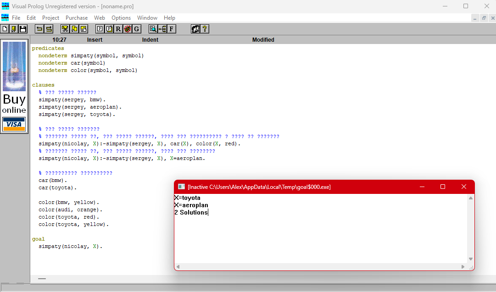

## Отчет по экспертной системе в Visual Prolog
### Введение
Экспертная система в Visual Prolog представляет собой программу, которая использует логические правила для вывода информации на основе предоставленных данных. В данном отчете рассматривается программа, которая определяет предпочтения Сергея и Николая в автомобилях и аэропланах, а также их цветах.



### Код программы:

```prolog
predicates
 nondeterm simpaty(symbol, symbol)
 nondeterm car(symbol)
 nondeterm color(symbol, symbol)
   
clauses
 % Что любит Сергей
 simpaty(sergey, bmw).
 simpaty(sergey, aeroplan).
 simpaty(sergey, toyota).

 % что любит Николай
 % Николай любит то, что любит Сергей, если это автомобиль и если он красный
 simpaty(nicolay, X):-simpaty(sergey, X), car(X), color(X, red).
 % Николай любит то, что любит Сергей, если это аэроплан
 simpaty(nicolay, X):-simpaty(sergey, X), X=aeroplan.

 % справочная информация
 car(bmw).  
 car(toyota).

 color(bmw, yellow).
 color(audi, orange).
 color(toyota, red).
 color(toyota, yellow).
   
goal
 simpaty(nicolay, X).
 ```

### Пояснения по работе программы
Программа определяет предпочтения Сергея и Николая в автомобилях, а также их цветах. Сергей любит BMW, аэропланы и Toyota. Николай, в свою очередь, любит то, что любит Сергей, если это автомобиль и если он красный, или если это аэроплан.

Справочная информация включает в себя определение, что BMW и Toyota являются автомобилями, а также указание цветов этих автомобилей.

### Вывод
Экспертная система в Visual Prolog позволяет эффективно решать задачи, основанные на логических правилах и данных. В данном случае, программа успешно определяет предпочтения Сергея и Николая, используя предоставленные правила и данные. Это демонстрирует мощь и гибкость Prolog как языка для создания экспертных систем, позволяя легко моделировать сложные логические отношения и выводы.  
Минус в том, что код для разных версий этой системы несовместим и невзаимозаменяем, что создает определенные трудности.