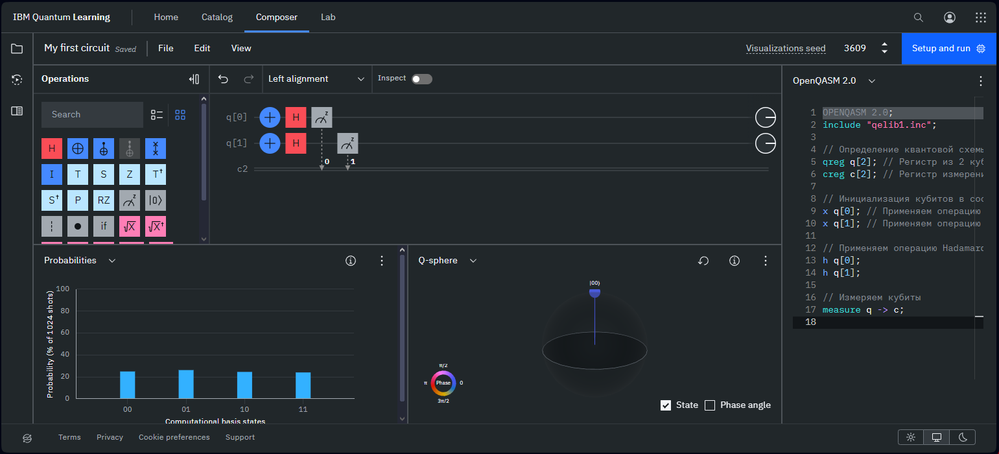

Мы создадим программу, которая демонстрирует базовую квантовую схему, включающую квантовую суперпозицию и измерение. Эта программа будет использовать два кубита и применять к ним операцию Hadamard (H), чтобы создать суперпозицию, а затем измерять результат.

```python
OPENQASM 2.0;
include "qelib1.inc";

// Определение квантовой схемы
qreg q[2]; // Регистр из 2 кубитов
creg c[2]; // Регистр измерений для 2 кубитов

// Инициализация кубитов в состоянии |0⟩
x q[0]; // Применяем операцию NOT к q[0] для перевода его в состояние |1⟩
x q[1]; // Применяем операцию NOT к q[1] для перевода его в состояние |1⟩

// Применяем операцию Hadamard к каждому кубиту
h q[0];
h q[1];

// Измеряем кубиты
measure q -> c;
```



Эта программа начинается с объявления версии OpenQASM и включения стандартной библиотеки `qelib1.inc`, которая содержит определения для базовых квантовых операций.  
Затем объявляются регистры кубитов `q` и регистр классических битов `c` для измерений. Сначала кубиты инициализируются в состоянии |1⟩ с помощью операции NOT (X), чтобы подготовить их к суперпозиции. Далее к каждому кубиту применяется операция Hadamard (H), создавая суперпозицию состояний |0⟩ и |1⟩.  
Наконец, кубиты измеряются, и результаты измерений сохраняются в регистре классических битов `c`.

Этот пример демонстрирует базовые возможности OpenQASM 2.0 для описания квантовых схем, включая инициализацию кубитов, применение квантовых операций и измерение результатов.

[**ссылка на облачный квантовый компьютер IBM**](https://quantum.ibm.com)